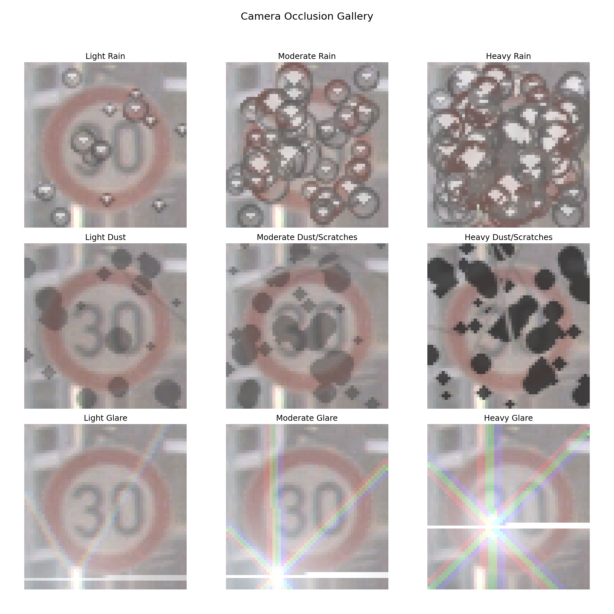

# Realistic Camera Occlusion Effects for Computer Vision
[](https://pypi.org/project/camera-occlusion/)

This project provides a Python library and tools for applying realistic, parameterized camera occlusion effects like rain and dust to images. It's designed for data augmentation in computer vision tasks, such as training a traffic sign classifier to be more robust against adverse conditions.




## Quick Start
```
pip install camera_occlusion
obscure-image GTSRB_dataset/GTSRB/Final_Training/Images/00000/00000_00000.ppm  out.ppm --effect rain
```

## Features

* **Rain Effect**: Simulates raindrops on a camera lens with distortion, shading, and highlights.
* **Dust Effect**: Simulates fine dust specks, scratches, and semi-transparent grime splotches.
* **Glare Effect**: Simulates sun glare effects.
* **PyTorch Integration**: Includes a `Dataset` class for on-the-fly data augmentation during model training.
* **Command-Line Tools**: Apply effects to single images or train a model directly from the command line.

## Installation

1.  **Clone the repository:**
    ```bash
    git clone [https://github.com/your-username/german_signs.git](https://github.com/your-username/german_signs.git)
    cd german_signs
    ```

2.  **Create and activate a virtual environment (recommended):**
    ```bash
    python3 -m venv venv
    source venv/bin/activate
    ```

3.  **Install the required packages:**
    ```bash
    pip install -e .
    ```

## Usage

There are three main ways to use this project:

### 1. As a Python Library

You can easily import and use the `Rain`, `Glare`, and `Dust` effect classes in your own scripts.

```python
import imageio.v2 as imageio
from camera_occlusion import Rain

# Load an image
image = imageio.imread("path/to/your/image.jpg")

# Apply a heavy rain effect
heavy_rain = Rain(num_drops=100, radius_range=(4, 8))
augmented_image = heavy_rain(image)

# Save or display the result
imageio.imwrite("rainy_image.jpg", augmented_image)
```

### 2. Gallery Demonstration

To see a gallery of all available effects and presets, run the example script. This will generate a plot showing various levels of rain and dust.

```bash
python examples/run_gallery.py
```

## License

This project is licensed under the MIT License. See the `LICENSE` file for details.
